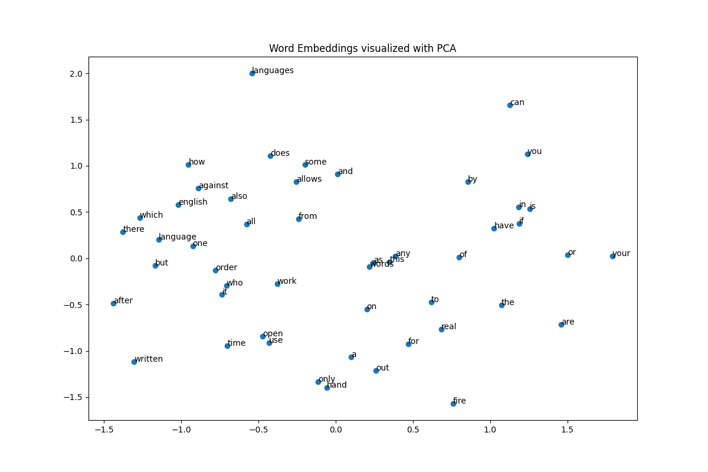
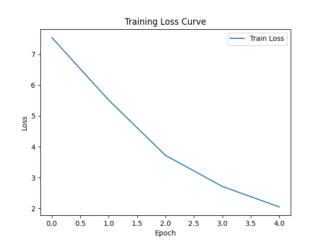

# NLP Foundations: From-Scratch Word2Vec & Transformer NMT

This repository showcases a structured progression through foundational and modern Natural Language Processing (NLP) architectures:
1. **Word Embeddings from Scratch (Module 1)**: A NumPy-only implementation of the Skip-Gram Word2Vec model, visualizing how low-dimensional vector spaces capture semantic associations.
2. **Neural Machine Translation (Module 2)**: A Seq2Seq Transformer model built with PyTorch (`cuda` accelerated) for translating English to German, evaluated using the standard BLEU metric.

---

## Word Embeddings (Skip-Gram from Scratch)

### Technical Details
- **Architecture**: Skip-Gram (predicts surrounding context words given a target center word).
- **Engine**: Pure NumPy (manual forward and backward propagation).
- **Optimization**: Gradient descent with manual weight updates on two projection matrices ($W_1$ and $W_2$).
- **Dimensionality**: 50-dimensional vectors.
- **Context Window**: 2.

### Dataset & Preprocessing
- **Source**: `word2vec_dataset.en`
- **Total Corpus Size**: 42,350 tokens.
- **Vocabulary Size (Min Count $\ge$ 5)**: 420 words (rebuilt with consistent indexing).
- **Generated Training Pairs**: 142,262 center-context relationships.

### Training Progress
The model trained for 10 epochs (Learning Rate = 0.025):

| Epoch | Training Loss |
| :---: | :---: |
| 1/10  | 2.9378 |
| 2/10  | 2.6948 |
| 3/10  | 2.6429 |
| 4/10  | 2.6163 |
| 5/10  | 2.5990 |
| 6/10  | 2.5868 |
| 7/10  | 2.5775 |
| 8/10  | 2.5702 |
| 9/10  | 2.5642 |
| 10/10 | 2.5593 |

### PCA Visualization Analysis

Applying Principal Component Analysis (PCA) to project the 50-dimensional embeddings onto a 2D plane reveals clear semantic and syntactic groupings:

<p align="center">
  
</p>

- **Semantic Coherence**: The model successfully clusters language-related terms in the upper-left quadrant (e.g., `languages`, `english`, `language`, `written`). This shows the Skip-Gram objective captures domain similarities purely based on context patterns [1].
- **Syntactic Clusters**: High-frequency function words and prepositions cluster cleanly in the upper-right region (e.g., `in`, `is`, `if`, `you`). Because these words appear in similar syntactic structures, the model maps them close to each other in the vector space [1].
- **Proximity Patterns**: Opposites or highly related pair associations, such as `only` and `hand` (frequently occurring in the phrase "on the other hand") or `or` and `your` are positioned near each other, demonstrating the model's sensitivity to multi-word collocations.

---

## Neural Machine Translation (PyTorch Transformer)

### Technical Details
- **Architecture**: Sequence-to-Sequence Transformer [7].
- **Configuration**: 2 Encoder Layers, 2 Decoder Layers, 4 Attention Heads, `d_model = 128` [10].
- **Positional Encoding**: Trainable parameter embeddings (maximum sequence length = 500) [8].
- **Acceleration**: Enabled GPU execution (`cuda`).

### Training Parameters
- **Dataset**: Europarl German-English parallel corpus.
- **Data Subset**: 6,000 sentence pairs (5,000 Train, 1,000 Validation).
- **Batch Size**: 32.
- **Optimizer**: Adam (`lr = 0.0005`) [10].
- **Loss Function**: Cross-Entropy (ignoring `<pad>` tokens) [7, 8].

### Training Loss Curve
The cross-entropy loss declined steadily across the 5 epochs:

| Epoch | Cross-Entropy Loss |
| :---: | :---: |
| 1 | 7.5441 |
| 2 | 5.5149 |
| 3 | 3.7188 |
| 4 | 2.7115 |
| 5 | 2.0480 |

<p align="center">
  
</p>

### Translation Evaluation
- **Validation BLEU Score**: **4.05** (Evaluated using SacreBLEU) [9].

#### Analytical Interpretation:
- **Optimization Stability**: The steep, smooth decline in the training loss curve verifies that the Adam optimizer successfully updated parameters without gradient spikes or divergence [8].
- **Performance Trade-Offs**: A BLEU score of 4.05 on the validation set is expected given the small training corpus of 5,000 sentences. Translating unseen language combinations is highly complex; a model trained on a small subset learns basic phrase pairings but struggles with generalization to validation data [5].
- **Opportunities for Scaling**: In a production environment, performance would be improved by:
  - Scaling up the dataset to the full Europarl corpus (>1.9 million sentences) [5].
  - Replacing greedy decoding with **Beam Search** to evaluate multiple translation hypotheses.
  - Initializing model embeddings with the pre-trained weights from the Word2Vec model [6].

---

## Key Learning Takeaways

Through the development and optimization of this repository, several core NLP engineering skills were acquired:

1. **Deep Mathematical Intuition**: Writing a Skip-Gram neural network in raw NumPy made backpropagation concrete [1, 2]. Manually calculating gradients, projection matrix dot products, and applying weight updates built a structural understanding of neural architectures that high-level frameworks (like PyTorch) typically abstract away.
2. **Geometric Properties of Latent Spaces**: Visualizing the word vectors with PCA illustrated how training objectives translate into geometric relationships [1, 4]. It demonstrated how semantic meaning can be modeled as vector similarity (cosine distance/proximity) [1].
3. **Handling Sequence-to-Sequence Paradigms**: Implementing a sequence-to-sequence Transformer reinforced practical components of machine translation, such as shifted-right teacher forcing (feeding `tgt[:, :-1]` as inputs to target output predictions), handling padding masks, and managing greedy auto-regressive decoding [7, 8].
4. **Hardware Acceleration & Scaling Limits**: Running the Transformer model on `cuda` highlighted the massive efficiency boost of GPU-based tensor operations over CPU training. It also illustrated the data-hungry nature of Transformers; massive architecture capacity requires proportionally larger datasets to prevent overfitting and achieve high BLEU scores [5].

---

## Quick Start Guide

### 1. Requirements
Ensure you have PyTorch, NumPy, Matplotlib, scikit-learn, and SacreBLEU installed:
```bash
pip install -r requirements.txt
```

### 2. File Placement
Dataset source: https://www.statmt.org/europarl/
Please place the source datasets in the following structure before execution:
```text
data/
├── word2vec_dataset.en
└── Europarl Dataset/
    ├── europarl-v7.de-en.en
    └── europarl-v7.de-en.de
```

### 3. Execution
To run both tasks sequentially, generate the plots, and print training logs, execute:
```bash
python run.py
```
